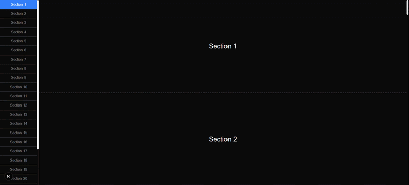

# react-use-section-observer

A lightweight React hook to track element visibility using the Intersection Observer API and automatically apply an active class to matching links.

---

## 🎥 Demo



---

## ✨ Features

- Tracks visibility of multiple sections
- Automatically updates matching anchor links
- Supports custom root containers
- Supports multiple class names (e.g. Tailwind)
- No DOM mutation via `data-*`
- No external dependencies
- Fully typed (TypeScript)
- Adjustable to your DOM structure

---

## ⚠️ Limitations

- Only vertical scrolling (Y-axis) is supported.
- Links must use the `href="#id"` format.
- Requires browser support for `IntersectionObserver`.

---

## 📦 Installation

```bash
npm install react-use-section-observer
```
